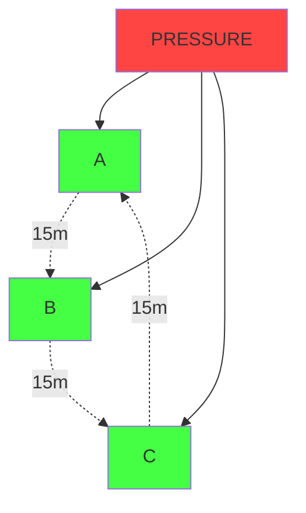
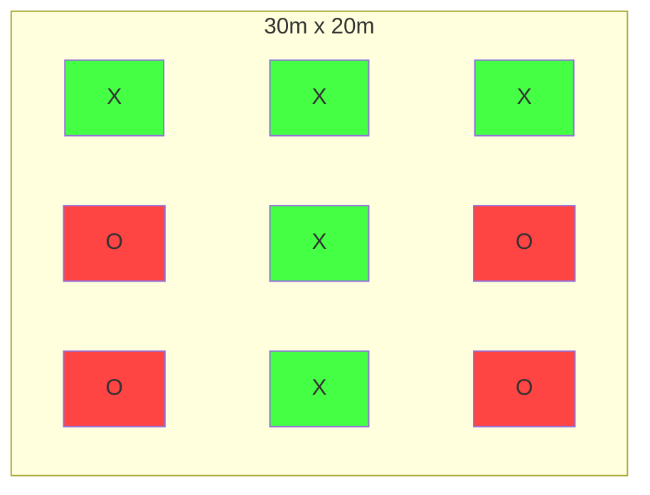
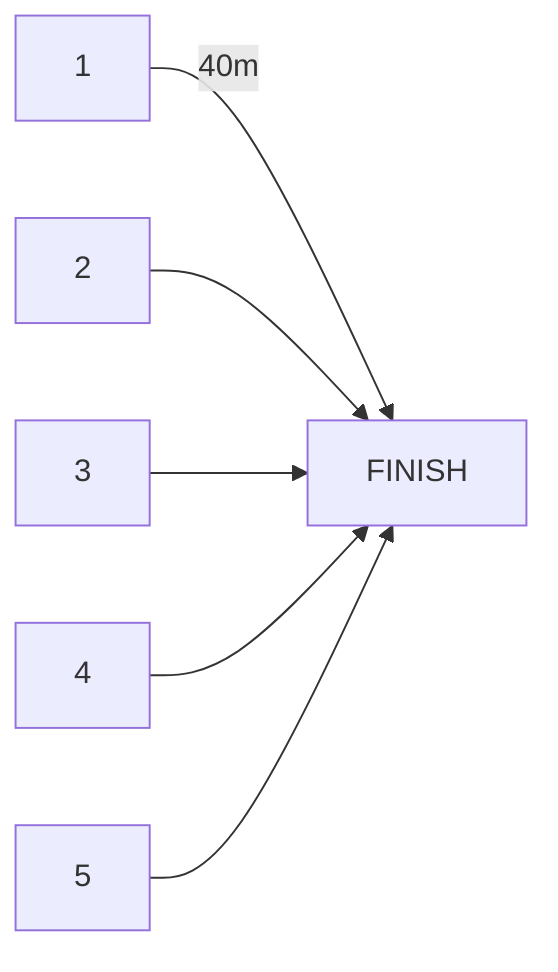

# ⚽ FIRST SESSION BACK

**60 minutes | Fitness Reality Check**

---

## 1. WARM-UP (10 min)

- Light jog → High knees → Butt kicks
- Side steps → Backwards jog → Dynamic stretches
- **Start easy - they think they're fitter than they are!**

---

## 2. SHUTTLE HELL (12 min)

**Setup:** START ——5m—— CONE A ——10m—— CONE B ——15m—— CONE C

**Round 1:** Out to CONE C and back (45s work, 45s rest) x3  
**Round 2:** 10-20-30m shuttle and back (60s work, 60s rest) x2

**⚠️ MUST TOUCH EACH CONE WITH HAND!**  
**📊 TIME EACH RUN - POST RESULTS!**

---

## 3. PASSING TRIANGLES (15 min)

**Phase 1:** 2 touch, pressure walking  
**Phase 2:** 2 touch, pressure jogging  
**Phase 3:** 1 touch, full pressure  
**Phase 4:** Add 2nd pressure player

**⚠️ Lose possession = 10 push-ups for triangle!**

---

## 4. POSSESSION BATTLE (15 min)

**Rules:**
- 10 consecutive passes = 1 point
- Ball out/intercepted = switch teams
- Games to 5 points
- **⚠️ Losers do fitness!**

**Punishments:**
- Lose ball under 5 passes = team sprint
- Passive defending = individual sprint

---

## 5. SPRINT FINISH (8 min)

**Round 1:** 40m x3 (90s rest)  
**Round 2:** 30m x4 (60s rest)  
**Round 3:** 20m x5 (30s rest)

**📊 POST ALL TIMES!**  
**No jogging to line - full sprint or nothing**

---

## 6. COOL DOWN (5 min)

- Light stretching
- **Reality talk about fitness levels**
- "This is your baseline - we go up from here"

---

## KEY REMINDERS

✓ Time everything & call out results  
✓ Short but frequent water breaks  
✓ Watch for real distress vs teenage drama  
✓ End with clear message about standards