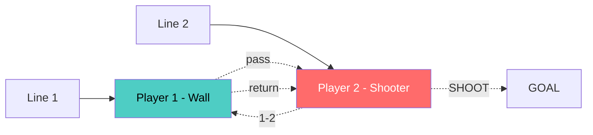

# ⚽ FIRST SESSION BACK - WHAT ACTUALLY HAPPENED

**60 minutes | Session Review**

---

## 1. WARM-UP (8 min)

- 2 laps of the pitch
- Light pace to get them moving again

---

## 2. SHUTTLE HELL (15 min)

**Setup:** START ——5m—— CONE A ——10m—— CONE B ——15m—— CONE C

**What we did:** 12 rounds of shuttles  
**30s on, 30s off** (rest started when first player returned)

**⚠️ MUST TOUCH EACH CONE WITH HAND!**  
**Result:** They were absolutely knackered!

---

## 3. PASSING TRIANGLES (12 min)

```
        A
       / \
      /   \
     /  P  \    (P = Pressure in middle)
    /       \   (15m triangle sides)  
   B---------C
```

**What we did:**
- 15m triangles with 1 pressure player in center
- 2 touch passing around the triangle
- Pressure player trying to intercept from middle
- Good intensity and communication

---

## 4. SHOOTING PRACTICE (15 min)



**How it worked:**
- 2 lines facing goal
- First player = passing wall
- Second player plays 1-2 and shoots
- First player collects ball, joins opposite queue
- Second player becomes new wall
- Good shooting practice with quick passing

---

## 5. LITTLE MATCH (10 min)

- Small-sided game to finish
- Let them play and enjoy it
- Good way to end the session

---

## DETAILED SESSION REVIEW

**What worked brilliantly:**
- **Shuttle runs were a massive success** - they enjoyed the challenge and took genuine pride in completing all 12 rounds
- Players were completely exhausted but had a real sense of achievement 
- Shooting practice had excellent flow and kept everyone engaged
- Triangle passing maintained good intensity throughout
- Perfect session structure - built from fitness through skills to game

**Player responses:**
- Initially groaned at shuttle setup but got competitive very quickly
- Genuinely tired but pushed each other through it - good team spirit
- Really enjoyed the shooting drill - good rhythm and everyone got plenty of touches
- Communication improved significantly during triangle passing as session progressed
- Finished the session on a high with the small match

**Key observations:**
- Fitness levels exactly as expected after 3 months off
- Competitive element in shuttles brought out the best in them
- **They respond really well to cardio-intensive starts** - sets the tone for the whole session
- Shooting practice kept them engaged even when legs were tired
- Passing under pressure improved noticeably as they got their touch back

---

## GOING FORWARD - SESSION FRAMEWORK

### 1. CARDIO-INTENSIVE STARTS (15 mins)
**DEFINITELY continue this approach - they thrive on the challenge**

**Shuttle variations to rotate weekly:**
- **Standard shuttles** (what we did) - baseline fitness test
- **Ladder shuttles:** 10m-20m-30m-40m-30m-20m-10m
- **Suicide runs:** 10m-return, 20m-return, 30m-return, 40m-return
- **Box shuttles:** 10m x 10m square, different directions each round
- **Sprint/jog intervals:** 30s sprint, 30s jog recovery x 10-12 rounds
- **Agility shuttles:** Include turns, backward running, side steps

**Keep the competitive element strong:**
- Time fastest/slowest rounds and announce them
- Last player back adds extra round for everyone
- Team challenges - split into groups, losing team does extra
- Personal best tracking week-on-week

### 2. PASSING UNDER PRESSURE VARIATIONS (12-15 mins)
**Build on triangle success with progressive difficulty**

**6-week progression plan:**
- **Week 2:** 4-player diamonds with 1 pressure player
- **Week 3:** 5v2 possession squares (15m x 15m)
- **Week 4:** 6v3 possession rectangles (20m x 15m) 
- **Week 5:** Triangle to triangle (2 separate triangles, switch possession between them)
- **Week 6:** Moving triangles (players can't stay static, must move after each pass)

**Intensity maintainers:**
- Start 2-touch, progress to 1-touch as they improve
- Add time pressure (must complete 10 passes in 60s)
- Punishment runs for lost possession (still works!)
- Gradually reduce area sizes to increase pressure
- Add second pressure player when they get comfortable

### 3. SHOOTING PRACTICE VARIATIONS (15 mins)
**Keep the excellent flow but rotate setups for variety**

**Different setups to cycle through:**
- **1-2 shooting** (what we did - keep as baseline) 
- **Cross and finish:** Wide player crosses, 2 players attack box
- **Rebound shooting:** Keeper saves first shot, second player finishes rebound
- **Turn and shoot:** Player receives back to goal, turns and shoots
- **Driven crosses:** Low crosses across box, players slide in to finish
- **Shooting circuit:** Multiple stations, rotate every 3 minutes
- **Volleys and half-volleys:** Server throws/kicks ball up for finish

**Flow maintenance tips:**
- Always keep 2+ balls per station minimum
- Players collect own shots when possible
- Quick rotation to maintain intensity
- Keep queues moving - no standing around

### 4. SMALL-SIDED GAMES (10-15 mins)
**Always finish with game-based practice**

**Game variations to rotate:**
- Normal small-sided games
- Possession-based games (8 consecutive passes = goal)
- Target games (hit cone/small goal for points)
- Transition games (quick turnover practice)
- Shooting games (can only score from outside area)

---

## NEXT SESSION PLANNING FRAMEWORK

**Session 2 suggestions:**
- **Fitness:** Try ladder shuttles (10-20-30-40-30-20-10m) - step up the challenge
- **Passing:** Move to 4-player diamonds with 1 pressure player
- **Shooting:** Cross and finish setup for variety
- **Timing:** Same 60-minute structure - it worked perfectly

**Key things to monitor going forward:**
- Are they maintaining shuttle intensity week-on-week?
- Can we reduce touches in passing drills without losing quality?
- How quickly do they adapt to new shooting setups?
- Are they getting fitter or do we need to increase demands?

**Equipment needs for variety:**
- More balls for shooting variations (need at least 6-8)
- Extra cones for different shuttle setups
- Bibs for game differentiation
- Possibly some small goals for variety

**Season-long fitness philosophy:**
- Start every session with high-intensity cardio work
- Build their conditioning through competitive drills
- Make fitness fun through variety and competition
- Track improvements to show progress