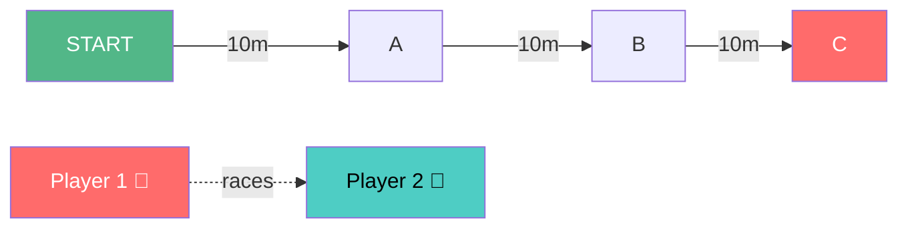
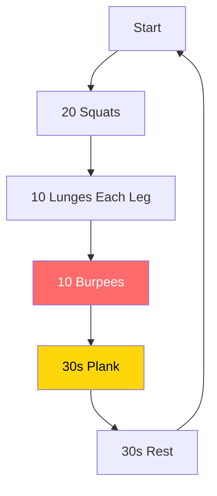
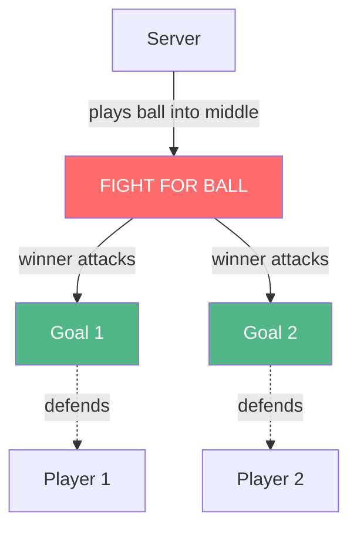
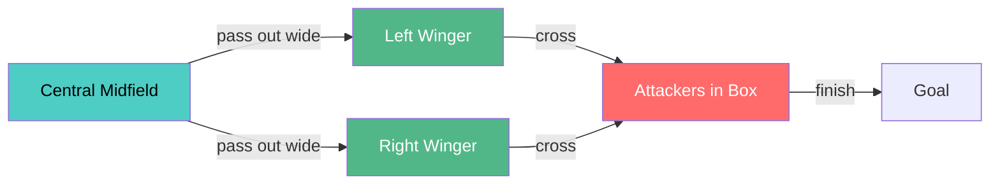

# ⚽ TRAINING SESSION - 2025-10-27

**60 minutes | COMEBACK - Not Nice to Play Against**

---

## 1. WARM-UP (3 min)
- 2 laps + dynamic stretches

---

## 2. LADDER SPRINTS - PAIRS COMPETITION (10 min)

**Setup:** START ——10m—— A ——10m—— B ——10m—— C (equal 10m gaps)

**8 rounds, pairs race each round:**
1. Start → A → Start (loser does 5 press-ups)
2. Start → B → Start
3. Start → C → Start
4. Start → A → Start
5. Start → B → Start
6. Start → C → Start
7. Start → A → Start
8. Start → C → Start (finish strong)

**40s rest between rounds**
**Touch each cone with hand**
**Winner gets 10s extra rest**

---

## 3. STRENGTH CIRCUIT (10 min)

**4 rounds, minimal rest:**

**Sequence:**
- 20 Squats (proper depth)
- 10 Lunges each leg (walking)
- 10 Burpees (chest to floor)
- 30s Plank hold
- 30s rest, then repeat

---

## 4. BOX WARS (10 min)

**Setup:** Penalty area width, mini goals at each end

**45s duels, random pairs:**
- 2 mini goals at opposite ends of penalty area
- Server plays ball into middle
- Fight for it, win it, score in opponent's goal
- Track wins publicly

---

## 5. CROSSING & FINISHING (12 min)

**Setup:** Wide areas + penalty box, 2 wingers stationed wide

**Format:**
- 2-3 players in middle start with ball
- Pass out to either winger (left or right)
- Sprint into box to attack cross
- Winger delivers cross immediately
- Rotate: crosser becomes central player, central becomes next in queue

**Cross variations:**
- Low driven
- High back post
- Cut-backs from byline
- Early from deep

**12 minutes continuous**

---

## 6. MATCH (15 min)

**Challenge:** Every player wins 3 physical duels in first 10 min or team does 10 burpees

**Duels count:**
- Tackles/interceptions under pressure
- 50-50s you win
- Headers you beat marker to
- Shielding under pressure

---
