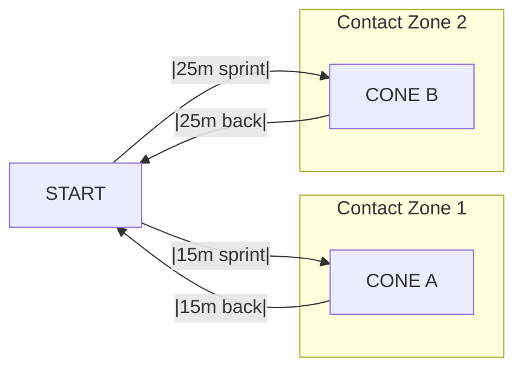
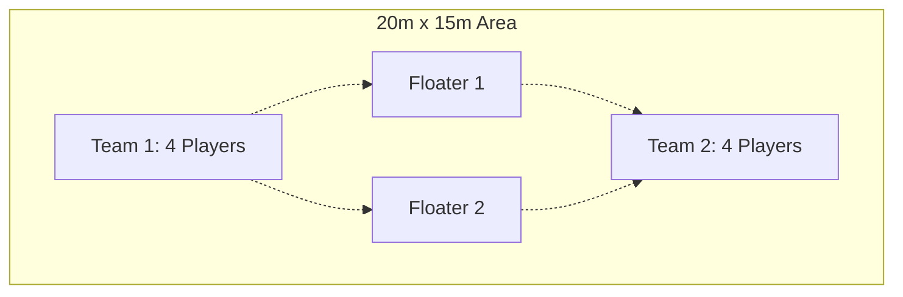
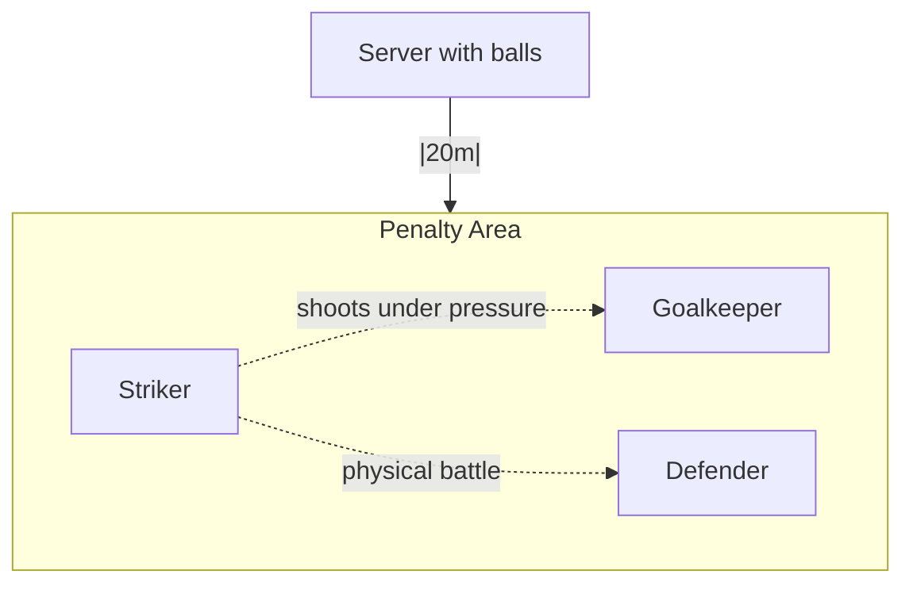
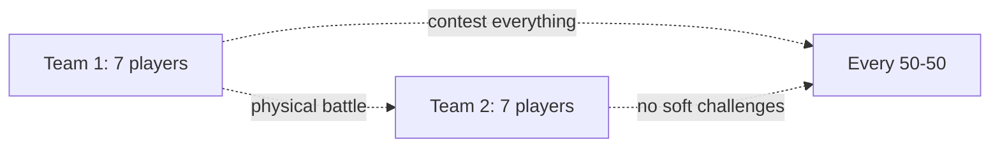

# ⚽ SESSION 3 - GET PHYSICAL: NO MORE MR. NICE GUY

**60 minutes | Physical Dominance & Mental Toughness Focus**

---

## 1. AGGRESSIVE WARM-UP (5 min)
- **1 lap light jog** + **1 lap at 70%** with shoulder contact every 20m
- **Dynamic prep:** High knees, butt kicks, side shuffles WITH CONTACT
- **Mental switch:** "We're done being nice - time to impose ourselves!"

---

## 2. GLADIATOR SHUTTLE WARS (20 min)

**WHAT ARE SHUTTLES:** Sprint out, sprint back, sprint out further, sprint back = 1 round



**Alternative ASCII Setup:**
```
START ——15m—— CONE A ——10m—— CONE B ——15m—— END
  P1             [X]            [X]           
  
CONTACT:     [ZONE 1: 12-18m] [ZONE 2: 27-33m]
```

**FORMAT:**
- **Rounds 1-8:** Standard shuttles (Start→A→Start→B→Start = 1 round)
- **Rounds 9-12:** HEAD-TO-HEAD - 2 players race, shoulder contact allowed in zones
- **Rounds 13-15:** GAUNTLET - 1 runner, others create legal obstacles in contact zones

---

## 3. BATTLE FOR POSSESSION (15 min)



**RULES:**
- 4v4 + 2 neutral players who play with team in possession
- Body contact allowed when challenging for ball
- Shield aggressively, press with intent

**2 × 7-minute scenarios:**

1. **Standard Battle (7 min):** 
   - Keep possession aggressively, shield the ball, press with intent
   - Every challenge must be committed - no soft tackles

2. **Pressure Cooker (8 min):** 
   - Must get ball into opponent's half within 30s or lose possession
   - Creates urgency → risky passes → loose balls → physical battles

---

## 4. WARRIOR SHOOTING (12 min)



**4 × 3-minute battle scenarios:**

1. **Back-to-goal battles:** 
   - Striker receives with back to goal
   - Defender applies physical pressure from behind
   - Striker must turn and shoot under contact

2. **Running battles:** 
   - Ball played into space between striker and defender
   - Both sprint from 15m back to compete
   - Winner of 50-50 challenge shoots immediately

3. **2v1 Quick Fire:** 
   - 2 defenders vs 1 attacker in penalty area
   - Attacker has maximum 2 touches only
   - Must use quick one-twos with server to create shooting chance
   - Defenders apply physical pressure throughout

4. **Free battle:** 
   - Open 1v1 situations from edge of box
   - Physical contact allowed as attacker drives toward goal
   - Defender can use body to block and challenge

---

## 5. BLOOD & THUNDER MATCH (8 min)



**Rules:**
- 7v7, full contact within laws of the game
- Every tackle must be committed - no pulling out
- Shield passes aggressively - protect your teammate's ball  
- Contest everything - headers, 50-50s, throw-ins
- **Punishment:** Team with most "soft" challenges = extra fitness