# ⚽ TRAINING - 17/11/25

**60 minutes | Passing & Shooting Focus**

---

## 1. WARM-UP (3 min)
2 laps + dynamic stretches

---

## 2. BALL RELAY RACES (12 min)

**Setup:** Cones at 30m, one ball per pair

**Working in pairs - races against other pairs**

**ROUND 1:** Dribble out, dribble back (both players)
**ROUND 2:** Dribble out, leave ball at cone, sprint back empty, sprint out, dribble back
**ROUND 3:** Speed dribble out and back - fastest wins
**ROUND 4:** Same as Round 2 but switch who goes first

**SCORING:**
- First pair back each round = 1 point
- Most points after 4 rounds wins

**Minimal rest between rounds - keep them blowing**

---

## 3. RONDO - KEEP BALL (15 min)

**Setup:** Multiple small grids (10x10 yards), bibs for defenders

**GROUPS:** Work in groups of 5-6 players

**ROUND 1 (4 min):** 4v2 BASIC
- 4 players keep ball from 2 defenders
- 2-touch maximum
- Defender wins ball or forces out = swap with player who lost it

**ROUND 2 (4 min):** 5v2 ONE-TOUCH
- 5 attackers, 2 defenders
- One-touch only
- Focus on movement and quick passing

**ROUND 3 (4 min):** 4v2 COMPETITIVE
- Count consecutive passes
- 10 passes in a row = defenders do 5 press-ups
- Lose ball before 10 = attackers do 5 press-ups

**ROUND 4 (3 min):** 5v2 WITH CONDITIONS
- Ball must stay below knee height
- One-touch preferred, two-touch allowed
- Switch defenders every 60 seconds

**Key points:** Quick feet, sharp passing, constant movement

---

## 4. BOX FINISHING - ELIMINATION CHALLENGE (20 min)

**Setup:** 2 small nets, balls scattered around each penalty area at different angles

**GROUPS:** Split into 2 groups, one per net

**THE CHALLENGE:** Score all 5 balls or you're out and sit down

```mermaid
graph TD
    subgraph "Penalty Area - Top View"
    G[🥅 GOAL]
    B1[⚽ 6yds left]
    B2[⚽ 6yds right]
    B3[⚽ 8yds center]
    B4[⚽ 7yds angle]
    B5[⚽ 7yds angle]
    
    P1[👤 Shooter]
    P2[👤 Waiting]
    P3[👤 Waiting]
    
    P1 --> B3
    B1 -.shoot.-> G
    B2 -.shoot.-> G
    B3 -.shoot.-> G
    B4 -.shoot.-> G
    B5 -.shoot.-> G
    P2 -.->|next| P1
    P3 -.->|next| P2
    end
```

**ROUND 1 (4 min):** 2-TOUCH FINISH
- Balls already placed
- Score all 5 or sit out
- First touch to set, second to shoot

**ROUND 2 (4 min):** 1-TOUCH FINISH  
- Balls already placed
- One touch only - side foot or instep
- Miss one = you're out

**ROUND 3 (4 min):** 2-TOUCH FROM PASS
- Feeder passes ball from side
- Control and shoot (2 touches max)
- 5 attempts, score all 5 or sit

**ROUND 4 (4 min):** 1-TOUCH FROM PASS
- Feeder passes ball
- First time finish only
- 5 attempts, miss one = out

**ROUND 5 (4 min):** TURN AND SHOOT (SURVIVORS ONLY)
- Feeder passes to shooter's feet (back to goal)
- Turn and shoot in one movement
- 5 attempts - who's left standing?

**Winner = Last player standing in each group gets bragging rights**

---

## 5. MATCH (15 min)

**Make teams from the pairs/groups**
Play with intensity
Bragging rights

---
