# ⚽ TRAINING - 13/01/25

**60 minutes | Welcome Back - Passing, 2v2 Battles & Shooting**

---

## 1. WARM-UP (3 min)
2 laps + dynamic stretches

---

## 2. RONDO PROGRESSION (15 min)

**Setup:** 15x15 grid, 2 teams of 6, bibs to distinguish teams

**ROUND 1 (5 min):** ONE BALL - BASIC KEEP BALL
- One ball between both teams
- Keep possession from the other team
- Two-touch
- Winning team gets the ball to start Round 2

**ROUND 2 (5 min):** TWO BALLS - STAY AWARE
- Each team has their own ball
- Keep possession of YOUR ball
- Don't interfere with other team
- Focus on movement and avoiding collisions

**ROUND 3 (5 min):** CHAOS - DEFEND & ATTACK
- Each team starts with their own ball
- Keep YOUR ball whilst trying to win and KICK OUT their ball
- Win their ball = boot it out of the grid
- Lose your ball = 5 press-ups, restart with possession

**Progressive chaos!**

---

## 3. 2v2 BATTLES (15 min)

**Setup:** One pitch in front of main net, cones for width (20-25 yards wide)

**GAME FORMAT:**
- 2min30s games
- Winners stay on
- Losers rotate off, next pair challenges
- Keep score if you want bragging rights

**ROTATION:**
- Pair 1 vs Pair 2 (2min30s)
- Winners stay, losers off
- Pair 3 challenges winners (2min30s)
- Winners stay, losers off
- Continue rotating - roughly 5-6 games

**RULES:**
- Normal play, shoot on sight
- If ball goes dead, restart quickly
- Keeper optional or rotating

**Key focus:** Work rate, quick transitions, communication

---

## 4. SHOOTING PRACTICE (10 min)

**Setup:** Main net, everyone together

**Phase 1 (3 min):** PLACED FINISHES

```mermaid
graph TD
    G[🥅 GOAL]
    P1[👤 Shooter]
    P2[👤 Next]
    P3[👤 Next]
    B[⚽]
    
    P1 -->|shoots| G
    P2 -.->|waits| P1
    P3 -.->|waits| P2
    B -.->|ball| P1
```

- Line up edge of box
- Take turns, placed finish into corners
- Accuracy over power
- Side foot, pick your spot

**Phase 2 (3 min):** POWER SHOTS

```mermaid
graph TD
    G[🥅 GOAL]
    S[👤 Shooter]
    N1[👤 Next]
    N2[👤 Next]
    B[⚽]
    
    S -->|POWER!| G
    N1 -.->|waits| S
    N2 -.->|waits| N1
    B -.->|ball| S
```

- Same setup, edge of box
- Driven finishes, hit the target
- Laces through the ball
- Power and accuracy

**Phase 3 (4 min):** CROSSES & ATTACKING

```mermaid
graph LR
    LW[👤 Left Winger<br/>⚽⚽⚽ balls]
    RW[👤 Right Winger<br/>⚽⚽⚽ balls]
    D1[👤 Defender]
    D2[👤 Defender]
    A1[👤 Attacker]
    A2[👤 Attacker]
    G[🥅 GOAL]
    
    LW -->|crosses| G
    RW -->|crosses| G
    A1 -.->|battles| D1
    A2 -.->|battles| D2
```

- 2 wingers (left & right) with multiple balls
- 2 attackers vs 2 defenders in the box
- Alternate crosses from each side
- Battle for the ball, attack near/far post
- Rotate attackers/defenders every 2 minutes

**Keep it moving!**

---

## 5. MATCH (20 min)

Make balanced teams
First game back - keep it flowing
Enjoy it!

---
