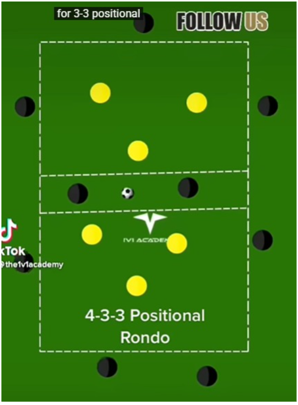

# Training Session - Monday 27th January 2026

**Duration:** 60 mins

---

## Warm Up (10 mins)
- Jog with ball, dynamic stretches
- Passing pairs on the move

---

## Rondo (10 mins)
- 2 rondos running side by side
- 4v2 in each
- 3 bib colours (4 per colour)
- Rotate which colour defends each rondo
- 2 touch max

---

## Progressive Possession (15 mins)

- Ball starts top, must reach bottom
- **Must pass through middle** - no skipping zones
- 2 defenders roam (can't enter middle)
- Point = successful top to bottom
- Rotate roles every 3 mins

---

## Winger Byline Scenarios (15 mins)
- Winger vs full back
- Winger starts wide, aims for byline
- If reaches byline: cross to 2 attackers vs 1 defender
- If defender wins: quick counter other way
- Both sides, rotate through

---

## Game (10 mins)
- Full pitch, normal rules
- Bonus point for goals from crosses

---
