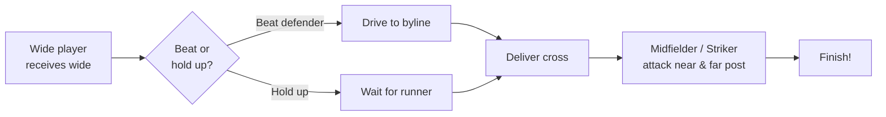
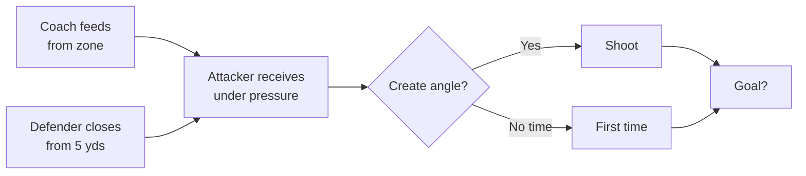

# Training — 16/03/2026
**60 mins | 13–16 players**

---

## 🔥 Warm-Up: 3-Team Keep-Ball (10 mins)

**Setup**
- 30×20 grid
- 3 teams of ~4–5
- 2 teams keep possession, 1 team presses

**Rules**
- Win it = swap with team that gave it away
- 5 consecutive passes = 1 point
- No standing still

**Progression**
- 3-touch first 5 mins → 2-touch second 5 mins

---

## ⚽ 2v1 Wide Scenarios (20 mins)

**Who does what**
- **Wide attackers** = wingers & full backs (both channels run simultaneously)
- **Late runners into box** = attacking/central midfielders
- **Defenders** = CDMs rotate in as the 1 defender per channel
- **Strikers** = in the box, attack the cross

**Setup**
- Wide attacker receives ball in wide channel, CDM defender between them and the box
- Midfielder makes a timed late run from deep to support in the box
- Striker occupies the defender at near post

**Rotation**
- Wide player → back of wide queue
- Midfielder runner → becomes wide player next rep
- CDM defender stays on for 2 reps, then rotates

**Coaching Points**
- Wide player: head up early, pick your moment — don't just whip it in blindly
- Midfielder: time the run — arrive as the ball arrives, not before
- Striker: pin the defender, give the cross a target
- Defender: stay on your feet, force wide, delay

**Progression (after 12 mins)**
- Add a 2nd defender → 2v2 in the box

---

## 🎯 Finishing Under Pressure — Different Angles (15 mins)

**Setup**
- Coach feeds from varying positions around the box
- Attacker receives with a defender starting 5 yards behind, closing immediately
- Must control, create the angle, and finish before the defender arrives
- Rotate through 4 starting positions — cycle through all of them

**The 4 Zones**

| Zone | Feed | Challenge |
|------|------|-----------|
| 1 – Central | Ball to feet, 5 yds from goal | Shoot quickly, no time to think |
| 2 – Wide right | Ball into channel | Cut inside or drive near post |
| 3 – Wide left | Ball into channel | Same — favour weaker foot |
| 4 – Back to goal | Ball to chest/feet, back to goal | Turn and finish in one movement |

**Scoring** — running tally across all zones, creates competition

**Coaching Points**
- First touch sets everything — get it out of your feet
- Decide early: shoot or create space?
- Defender should be competitive — not a walkover

---

## 🏟️ Match Play (15 mins)
- Free game
- Encourage wide play, crossing, 1v1 finishing — reward what they've worked on
