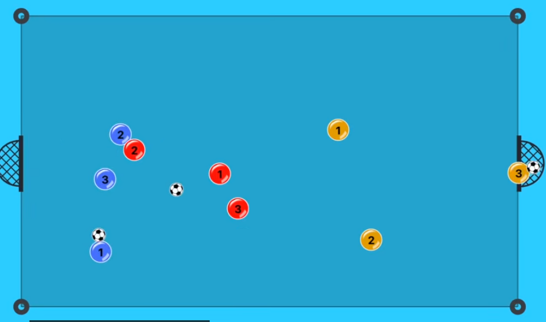
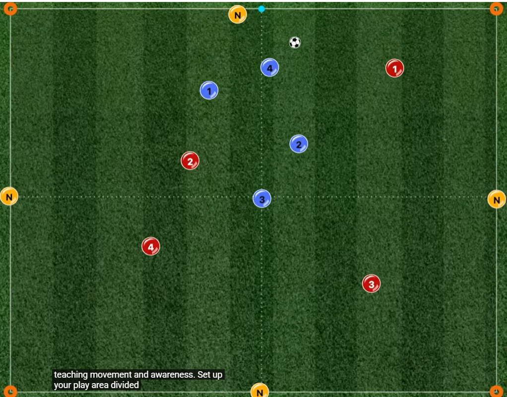

# Training Session - Monday 9th February 2026

**Duration:** 60 mins

**Focus:** Endurance + finding space off the ball

---

## WARM UP LAPS (5 mins)
2-3 easy laps. Dynamic stretches on the move - high knees, heel flicks, side shuffles.

---

## RONDO

**Setup:** Bibs of 3, keeping the ball between 2, other trying to intercept, 2 sets of 3 together

**Scoring:** After 5 passes score in either end for a point

**Coaching notes:** Promotes movement off the ball, awareness of others

---

## QUADRANT BALL

**Setup:** Rectangle from previous but in quadrants

**Progression:**
- 2 teams of 3, 6 on the outside
- players must go new quadrant before they can receive a pass again
**Coaching notes:** Promotes movement off the ball, awareness of others

---

## LONG RANGE SHOOTING

**Setup:** Shooting from outside the box

**Progression:**
- Knocking out in front of feet from standing
- Running full pelt
- Striking first time from a lay off
- Maybe some 2v1s

**Coaching notes:** Shooting, finishing, long distance

---

## MATCH (15 mins if time)
Normal rules. Let them apply the movement patterns from the space ball game.

---
